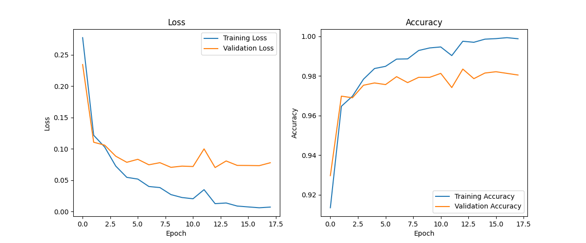

# Neural Network from Scratch in NumPy

I built this project to create a simple, fully-connected neural network from the ground up using only NumPy. It's designed to classify the classic MNIST handwritten digits and demonstrates the core concepts of a neural network, including forward/backward propagation and gradient descent.

## How It Works

The code is split into a few key files to keep things organized:

*   **`src/data_loader.py`**: This script just handles loading the MNIST dataset from the local `MNIST` directory and getting it ready for the network (normalizing, one-hot encoding, etc.).

*   **`src/neural_network.py`**: This is the main engine. It's a class that contains all the logic for the network itself, including the weight/bias initialization, the forward and backward passes, and the training loop with early stopping logic.

*   **`src/train.py`**: This is the script you run to kick everything off. It pulls in the data, creates a `NeuralNetwork` object, tells it to train, and then saves the final accuracy graph. I also created `src/train_lr_001.py` to test out a different learning rate separately.

*   **`tests/`**: This folder holds some basic unit tests I wrote to make sure the math in the forward and backward passes was correct. It uses a numerical gradient check, which is a good way to verify that the backpropagation logic is solid.

## Usage

Getting it running is straightforward:

1.  **Clone the repo:**
    ```bash
    git clone https://github.com/GangaNaveenPotu/Neural-Network-from-Scratch-with-NumPy.git
    ```

2.  **Install dependencies:**
    ```bash
    pip install -r requirements.txt
    ```

3.  **Run the main training script:**
    ```bash
    python -m src.train
    ```
    This will run the best-performing model and save its training graph as `training_history.png`.

## Results & A Note on Learning Rates

After some tuning, the final model gets around **97.9% accuracy** on the test set.

A big part of getting this result was finding a good learning rate. I experimented with a couple of different setups, and it really shows how much of a difference this one hyperparameter can make.

#### Experiment 1: High Learning Rate (0.1) with Early Stopping
This was the clear winner. It trained very fast and stopped itself at **18 epochs** because the validation accuracy had stopped improving. It achieved the best result (**~98%**). This approach is great because it finds a good solution quickly, and the early stopping mechanism prevents the model from overfitting by saving it at its peak performance. For any real-world use, this is the way to go.

#### Experiment 2: Low Learning Rate (0.001)
This was much, much slower. After letting it run for a full 100 epochs, it only reached about **95% accuracy**. You can see from its graph that it was learning steadily without overfitting, but it would have taken a huge number of additional epochs to get close to the result from the first experiment.

**Conclusion:** For any real-time application, the first model is better. It's not only faster to train, but it produced a more accurate final model, which is what you need when making live predictions.

### Final Model Training History
*(From Experiment 1)*
